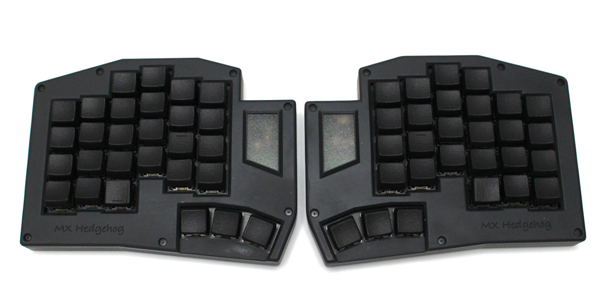
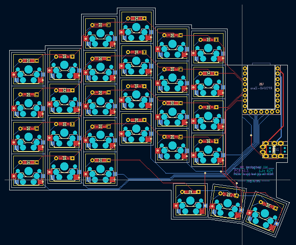

Hedgehog (MX)
=======

DIY keyboard "Hedgehog"

---

## Feature

- Small key pitch (17x16)
- Split
- Size : 60% (56 keys)
- Layout : Coloumn staggered
- Controller board : Waveshare RP2040-Zero
- - Supported firmware : [QMK Firmware](https://docs.qmk.fm/#/) and Vial
- Gasket mount like 3D Printed case

## PCB Image

Designed by KiCad

## CaseImage

Designed by FUSION360
