Hedgehog (MX) ビルドガイド
=======

## 注意

### 取り付け位置に注意

当モデルの PCB はリバーシブルです。

各パーツの実装面を誤ると動作しません。  
とくに __コントローラーボードのはんだ付けが厄介__ です。

### ケースデータが干渉する可能性

USB と TRRS 用の穴は、それほど余裕がありません。
接続口写真を掲載します。

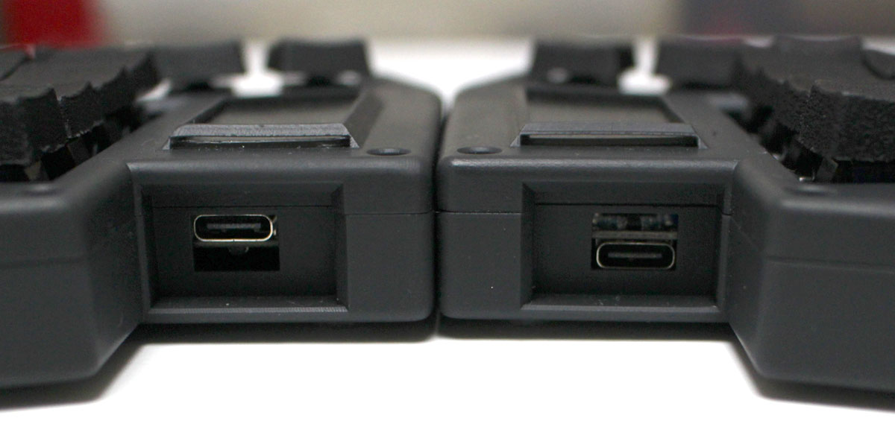
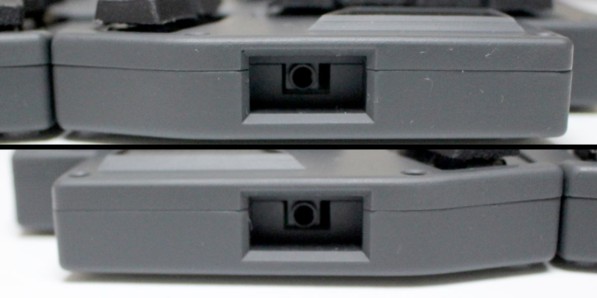

プリント方法やクッション材の高さによってはケースとの干渉が発生するかもしれません。

なお作者は JLCPCB のブラックレジンでケースを作りました。

### 窓のあるデザイン

コントローラーボード部分には窓があります。  
窓には 1.0 - 1.2 mm 程度の板をカットして差し込みます。

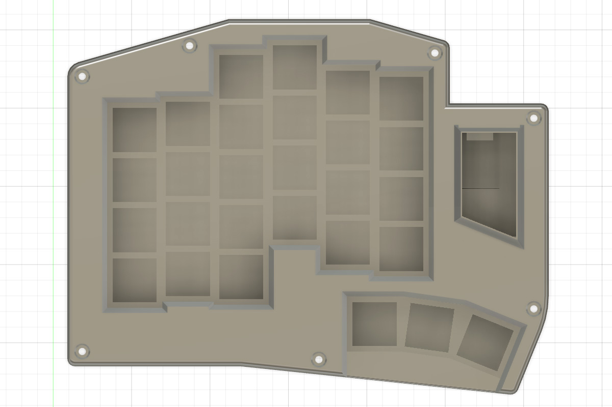

BOOT 、 RESET ボタンを操作する想定で穴を開けましたが、右手側はボタンが裏面になるため無意味でした。

デザインとしてお楽しみください。

なお、まだ図面を作成していません。
作者は 100 均で 1.0mm のプラ板を買ってきてフリーハンドでカットしたものを装着しています。

## 組み立てフロー

- 実装面確認
- ダイオードのはんだ付け
- スイッチソケットのはんだ付け
- コントローラーボードのはんだ付け
- TRRS ケーブルジャックのはんだ付け
- ファームウェア書き込み
- ケースとりつけ

## パーツリスト

|名称|数量|備考|
|:--|--:|:--|
|PCB|2||
|スイッチプレート|2||
|Waveshare RP2040-Zero|2||
|ダイオード|56|表面実装タイプ|
|スイッチソケット|56|MX スイッチ用|
|TRRS ジャック|2||
|MX 互換スイッチ|56||
|キーキャップ|56|0.8U|
|USB Type-C|1||
|TRRS ケーブル|1||

標準 3D プリントケースを利用する場合は次が必要です

|名称|数量|備考|
|:--|--:|:--|
|M2 スペーサー 10mm|14||
|M2 ネジ|28|長さは 5mm を推奨|
|クッション材|適量|3.0mm 厚 1.5mm 厚の種類。カットできるもの|
|クッションゴム|適量|底にとりつけるもの|

## 組み立てよう

### 実装面確認

PCB を左右 2 枚並べ、できあがりをイメージしましょう。

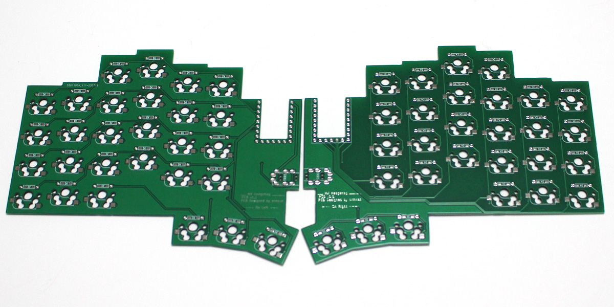

はんだ付け面を間違えないように、マスキングテープを貼って書き記しておくことを推奨します。

### ダイオードのはんだ付け

_裏面_ にダイオードをはんだ付けします。

ダイオードの向きに注意してください。

### スイッチソケットのはんだ付け

_裏面_ にスイッチソケットをはんだ付けします。

### コントローラーボードのはんだ付け

当キットの最難関部分です。

写真のとおりに配置してください。裏、表を誤るとケースに干渉します。

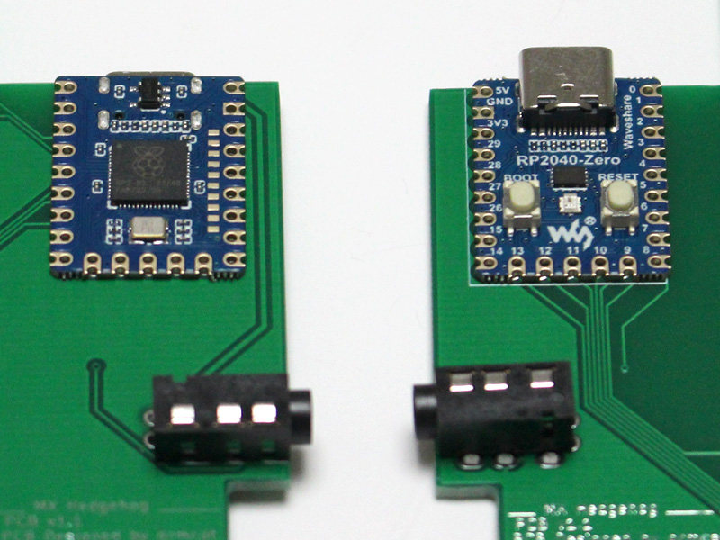

コントローラーボードのはんだ付けはリカバリが困難です。  
作者でも 2 度間違えました。

向き、取り付け面は 3 回以上確認することを推奨します。

#### 左手用

_BOOT ボタンのある面を下_ にし、 PCB の表面に配置します。

#### 右手用

_BOOT ボタンのある面を上_ にし、 PCB の表面に配置します。

#### コントローラーボードのはんだ付け

向き、取り付け面を確認したら、マスキングテープで仮止めし、はんだ付けを行います。

PIN の端にはんだごてを当て、多めにはんだを流し入れます。

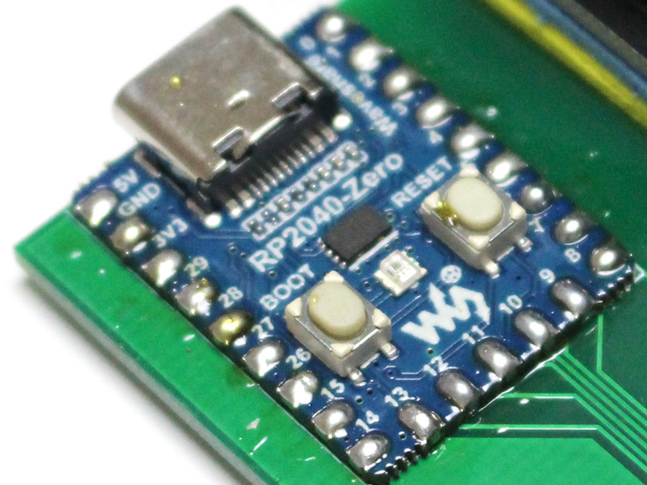

裏面に少し山ができる程度が目安です。

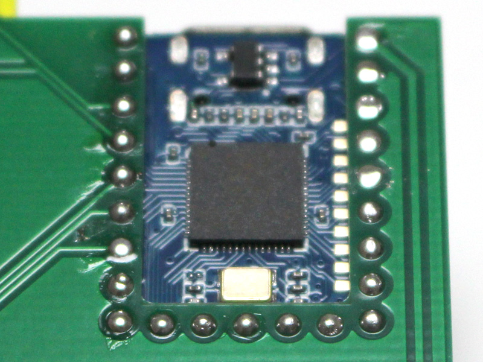

__このはんだ付けは難しい__ です。  
変な設計でごめんなさい。

### TRRS ジャックのはんだ付け

_表面_ に TRRS ジャックを取り付けます。

マスキングテープで仮止めし、PCB をひっくり返して足をはんだ付けします。

### ファームウェア書き込み

次手順で書き込みます。

- パソコンに接続する
- BOOT ボタンを押しながら RESET ボタンを押す
- RESET ボタンを戻す
- BOOT ボタンを戻す
- マウントされた USB マスストレージ (RPI-RP2) に、 UF2 をドラッグ & ドロップする。

### 組み立て

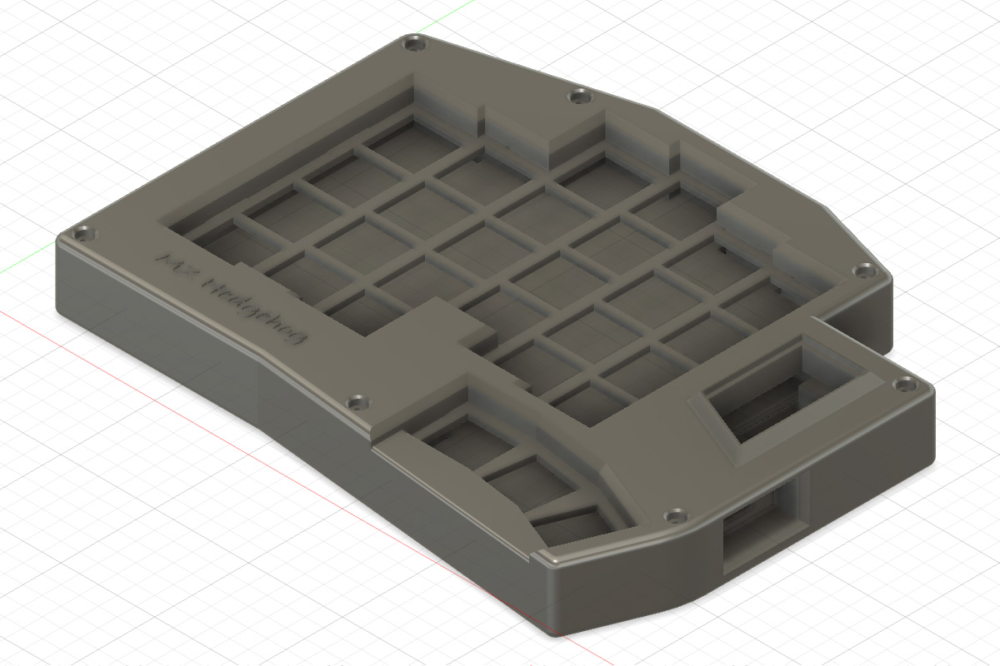

トップケースイメージ

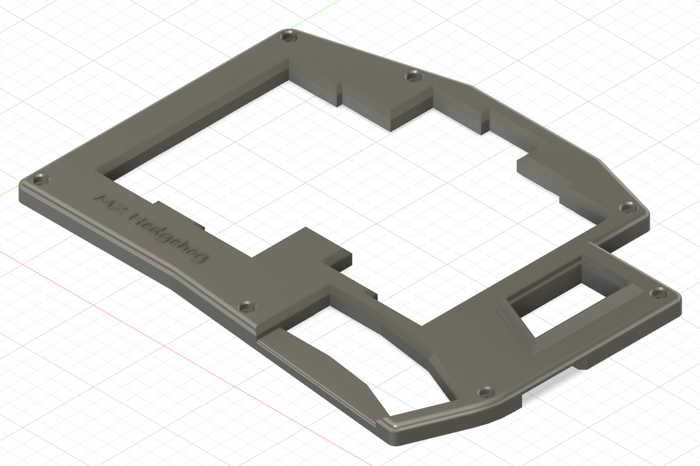

ボトムケースイメージ

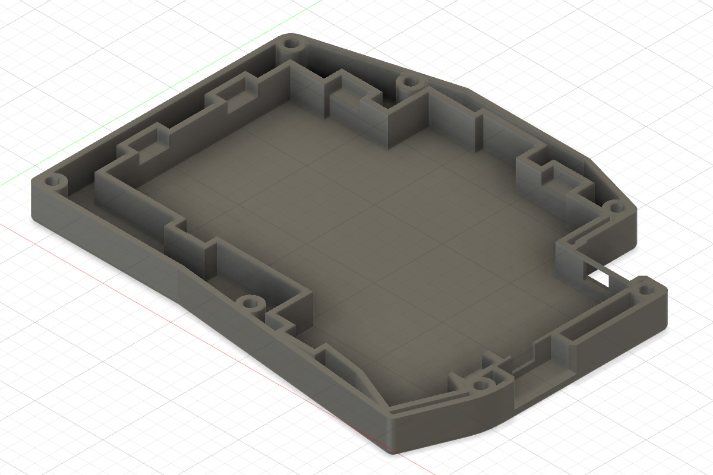

#### クッションを貼る

スイッチプレートとケースの間にクッションを挟む、ガスケットマウント風マウントです。

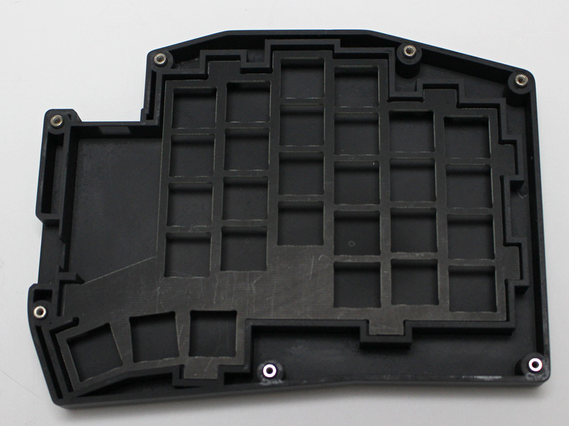

ポロンゴムを細長く切り、スイッチプレート、ケースの所定位置に貼り付けます。

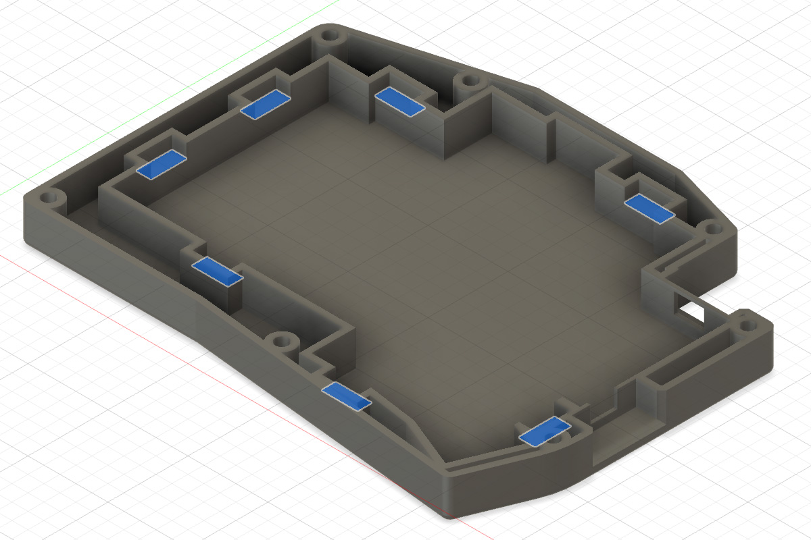

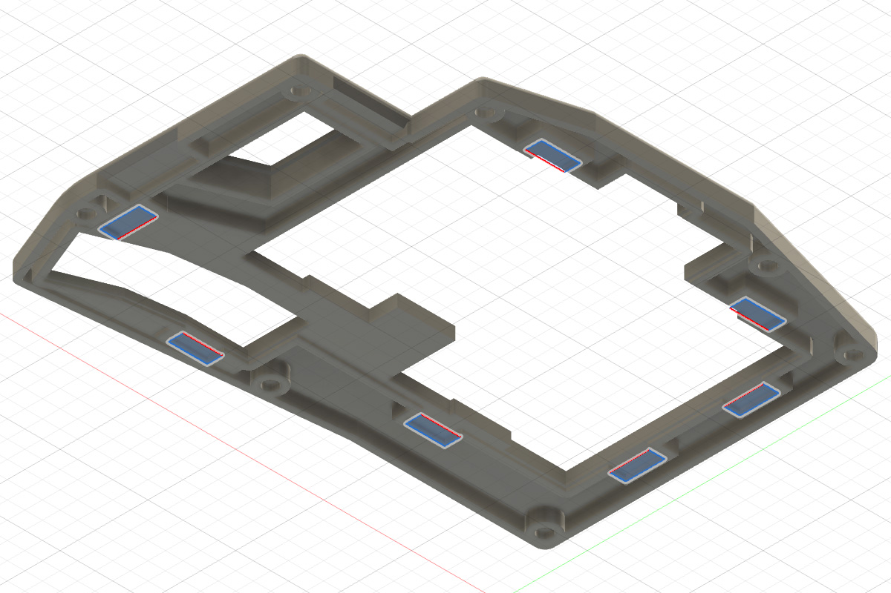

なお、ボトムケースのマウント部からスイッチプレート下面までの位置は _3.0mm_ で設計しました。  
対して、スイッチプレート上面からトップケースまでは _1.0 〜 1.5mm_ です。

ボトムケース、トップケースと、スイッチプレートの下のみの 3 面にクッションをはれば、1.5mm 厚の一種類で間に合うと思います。（未検証。ある程度厚みがあっても吸収するはず？的な考え）

作者はスイッチプレートと PCB の間にフォームなどを挟んでおり、スイッチプレート耳部分にもフォームを出すことで、ボトムケース、スイッチプレートのクッションとして利用しています。

#### スイッチを取り付ける

PCB にスイッチプレートを重ね、スイッチをすべて取り付けます。

#### ケース

ボトムケースのスリットに M2 スペーサーを入れ、裏側からネジで固定します。

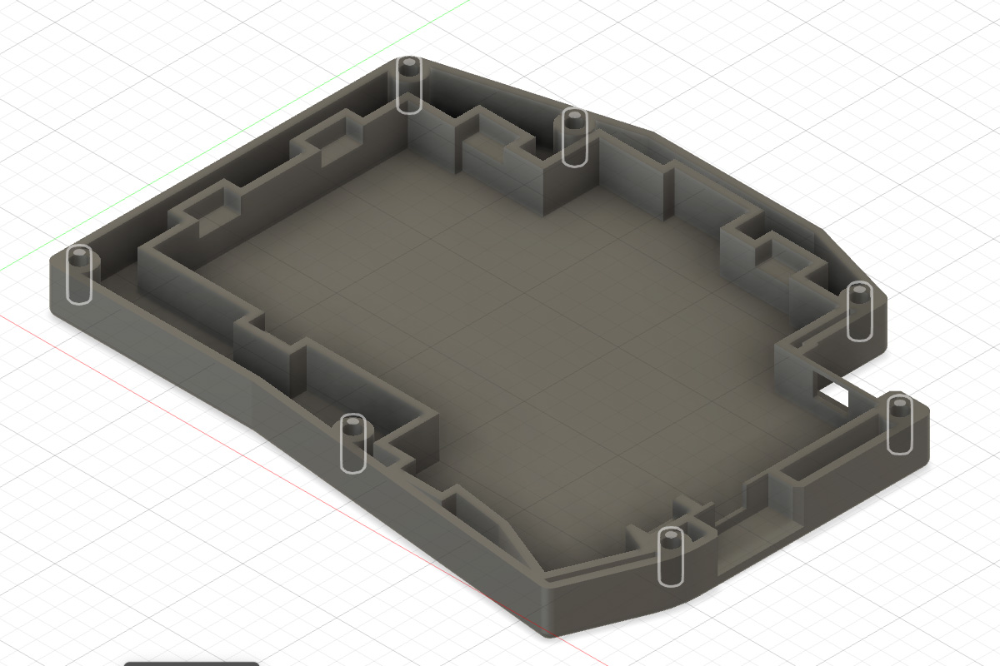

次に、ボトムケースに PCB を載せます。  
USB 接続端子を先に穴に通してから全体を乗せ瑠葉にしてください。

PCB が収まったらトップケースを上からはめ、ネジ止めします。

---

おめでとうございます。  
完成です。

